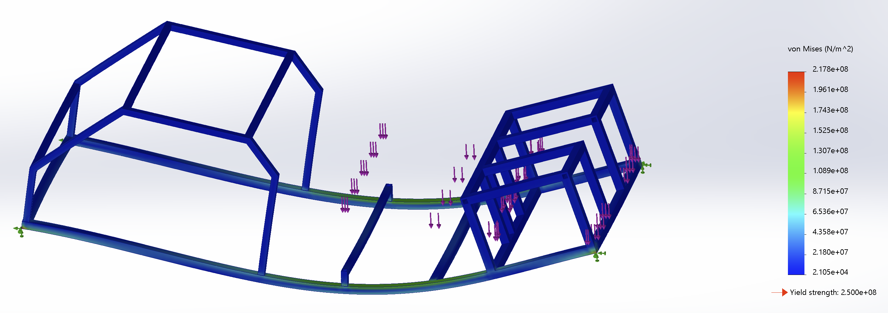
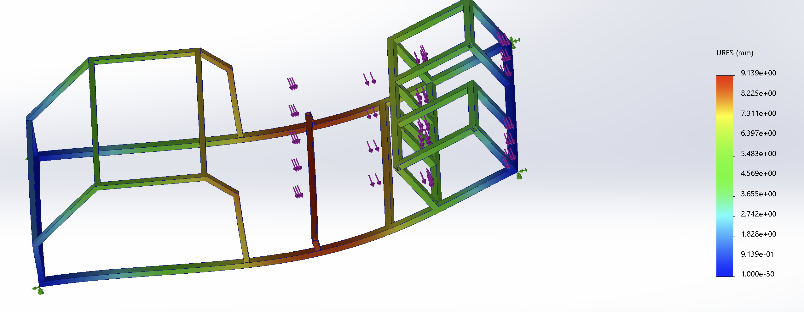
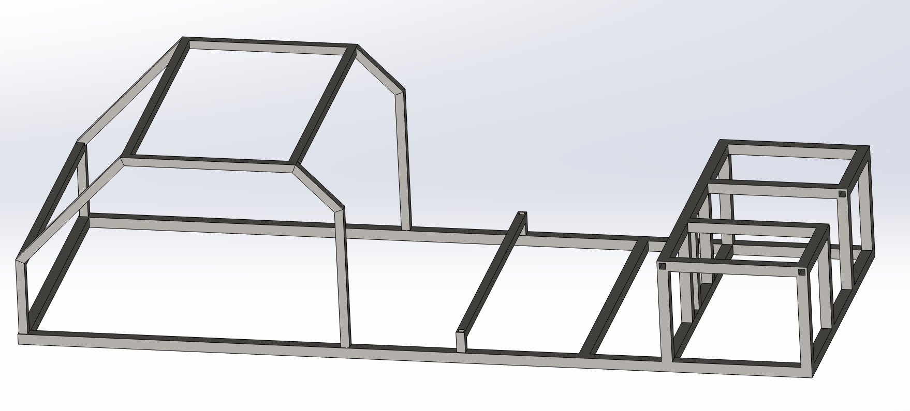
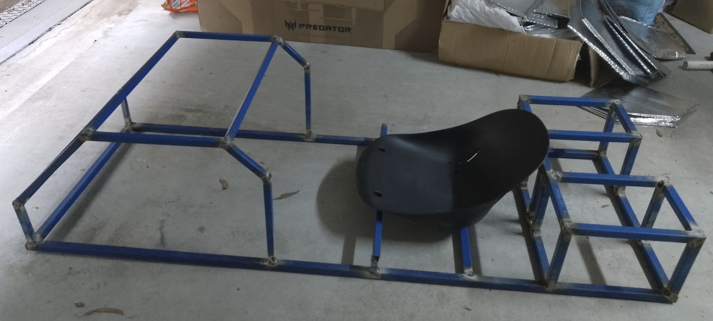
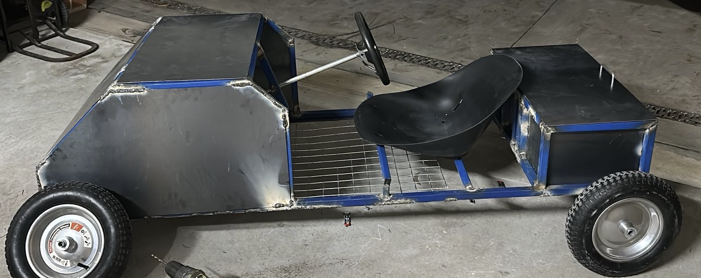
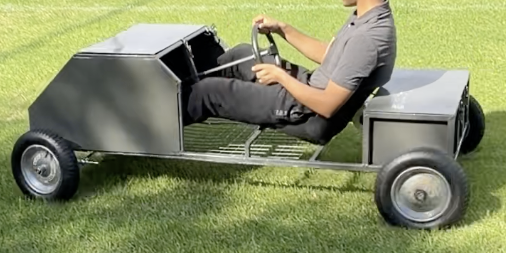

# Electric Go-Kart Engineering & Fabrication
Co-designed and fabricated a full electric go-kart from scratch, covering structural 
design, FEA simulation, MIG fabrication, and powertrain integration.

## Overview
Most hobby electric go-karts use off-the-shelf frames with minimal engineering 
validation. This project involved designing and fabricating a custom chassis 
from raw mild steel, integrating a high-voltage battery pack, and validating 
structural integrity through SolidWorks FEA before committing to fabrication.

**Key specs:**
- 72V 3000W brushless motor
- 6× 12V 22Ah Lead Acid AGM batteries in series
- ASTM A36 mild steel chassis, MIG welded

## Structural Design & FEA
Designed the primary chassis and battery holding beams in SolidWorks. Ran 
static FEA using ASTM A36 mild steel properties (yield strength 250 MPa) 
under conservative loading conditions:

- Occupant load: 150kg (>2× maximum rider weight)
- Battery load: 100kg (>2× actual battery weight of 42kg)

Stress concentrations at boundary condition nodes were identified as FEA artefacts
resulting from point loads applied over an idealised zero-area contacts, which 
overestimates local stress. After excluding these artefacts, the representative 
peak stress in the loaded structure was ~108 MPa, giving a **Factor of Safety > 2** 
against yielding. Maximum deflection was **0.9cm**.

### Stress Plot (von Mises)

### Displacement Plot

### CAD Model

## Manufacturing & Fabrication
- Chassis fabricated from ASTM A36 mild steel square section using 
  **Gasless MIG Welding**
- Sheet metal enclosures fabricated for battery and electronics housing
- 6× 12V 22Ah Lead Acid AGM batteries wired in series via **soft soldering** 
  to achieve 72V nominal pack voltage
- Powertrain integration including motor mounting and wiring

## Testing & Optimisation
Conducted physical testing to validate vehicle kinematics and load distribution. 
Employed iterative slow-motion video analysis using mounted phone cameras to 
diagnose drivetrain issues — during initial powertrain integration, the chain 
repeatedly slipped under load. A phone was mounted inside the drivetrain 
compartment to capture slow-motion footage of the chain under operation, 
revealing that the sprocket had been welded onto the axle at a slight angular 
offset, causing consistent chain slip to one side. The sprocket was re-welded 
to correct the alignment, resolving the issue.

## Specifications
| Parameter | Value |
|-----------|-------|
| Motor | 72V 3000W brushless |
| Battery pack | 6× 12V 22Ah AGM (72V series) |
| Battery chemistry | Lead Acid AGM |
| Chassis material | ASTM A36 mild steel |
| FEA peak stress | ~108 MPa |
| FEA FoS | >2 |
| Max deflection | 0.9 cm |

## Skills Demonstrated
- SolidWorks CAD and static FEA
- Structural analysis and load case definition
- Gasless MIG welding and sheet metal fabrication
- High-voltage battery pack integration and wiring
- Powertrain integration and drivetrain assembly
- Iterative fault diagnosis using slow-motion video analysis
- Physical testing and root cause analysis
